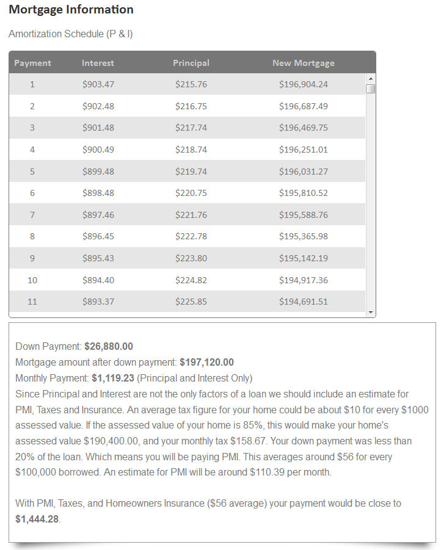

# Mortgage Amortization Calculator
		
### Description

This application is a Mortgage Calculator for your site viewers that gives them an idea of what their monthly breakdown of payment will look like.  It includes output of an Amortization schedule along with estimated costs for other items involved in a loan payment (PMI, Taxes etc.).  The application comes with optional configurable elements, for example you can choose whether or not to let your customers recieve an email with a pdf of the mortgage information (along with a bcc copy to you if you want).  The Calculator is meant to be simple for site visitors and configurable for you.  You can also choose to set whether the amortization schedule and loan information appears in a div, a modal, or a popup for the results.

---

  - Usable on all PHP 5.2+ sites.
  - Choice of results displayed in a div, modal, or a popup window.
  - Choice to let users recieve a PDF emailed to them with the results.
  - Choice to recieve a bcc copy so you can contact the user and generate leads.
  - No database setup required.
  - Ajax driven, no page reload.
  - Attractive calculator.
		  



		
### Requirements
  - A webserver (tested to work in a linux hosting environment)
  - An unzip program to extract the files
  - PHP 5.2+
  - PHP mail function capability (if using the email PDF option)
		
### Quick Start
  - To install, extract the zip file included on your webserver.  The default name of the folder is mortgageCalc, make note of this or if you change the name.
  - Make sure config.php is writable if you want to use the admin.php page to make your changes, (else you can hand edit config.php).
  - Either open the webpage (www.yoursite.com/mortgageCalc/admin.php) or open config.php in a file editor.
  - The only settings necessary to change are the website and url variable.  Set website to your website address, and url to the path of the morgage calculator, no trailings slashes (e.g. http://www.yoursite.com/mortgageCalc).
  - Change the other settings as desired.
  - Link to the file from your website page.  You can use the divLoad.php script inline in one of your pages, or you can use the index.php and style it as you want by opening the file you want to include the calculator in and insert <?php include 'mortgageCalc/divLoad.php'; ?> for the div or <?php include 'mortgageCalc/index.php'; ?> for the whole page (make sure your paths are correct).  You can also link to the index.php page in your html.

You are done! Or you can adjust the other settings like email pdf options and default field values etc. back on the admin.php page or in the config.php file.  You may want to remove the admin.php file or rename it to prevent anyone from changing your settings.
			
---

### Installation

To install, extract the zip file on your webserver taking note of the directory you put it in.  Open your browser to www.yoursite.com/mortgageCalc/admin.php (or the folder you put it in) to configure the calculator, or you may choose to hand edit the config.php file with your settings in the root directory.  

If you use the browser config, make sure that config.php is writable (chmod 777 config.php) before you edit it.  After that you can adjust the settings to how you would like and test out the demo file (index.php) in the root directory.  You may also test with the files in the examples folder to check your settings.  All configurable items have info tips explaining their usage.  

The config.php file explains each setting as well.


The admin page (or if you edit the config.php by hand) contains the following configurable options:
		
  - Default Home Price</b> - This is the default form field value for Purchase Price.
  - Default Interest Rate</b> - Default form field value for Interest Rate.
  - Default Down Payment</b> - Default form field value for Down Payment Amount.
  - Default Term of Loan</b> - Default form select value for Loan Term.
  - Homeowners Insurance Rate</b> - Value for monthly rate to include.
  - PMI - Private Mortgage Insurance Rate per 100,000.00 dollars.
  - Layout - Choose for results to appear in a div, a modal window, or a popup window.
  - Website Address - Your website address, used only for reports sent via PDF to their email.
  - URL - Used for scripts and file reference locations (include http://), no trailing slashes, this setting is required!.
  - Allow Email - Choose to let customers select to recieve a PDF email or not.
  - Your Email Address - Used for bcc to you so you can contact customers that use the form.
  - From Email Address - Used as the from field when an email PDF goes to a visitor (some servers require this field to send mail)
  - Disclaimer - You can edit the disclaimer text shown below the calculator if you would like.

After you finish the install and your settings, you may include the divLoad.php in another php page by using a method similar to the examples/testDiv.php file:
```php         
<?php include "mortgageCalc/divLoad.php"; ?>
```

Alternately you can link to the index.php script in the mortgageCalc directory, and change styles to fit with your site.

Remember to use the correct path to the script if you are including.
	    
### Core Files and Structure

		This is an explanation of the files included and their purpose.
		
root folder
  - admin.php - This page is the administrative page for the config file (config.php), it's purpose is to let you configure your settings without editing config.php by hand.
  - calc-ws.php - This file is the ajax processing script for both the admin.php and the calculator files
  - config.php - This is your main configuration file for the calculator settings with descriptions for each.  You can hand edit the entries or use the frontend admin.php script
  - config.php.bac - This is a backup of the default settings for the config file, just in case you need it.
  - divLoad.php - This is a script to make it easy to include the calculator in other pages, it consolidates everything needed into a div.
  - index.php - This is the main calculator script, you can use this as is or modify it to fit into your theme.
	
css folder
  - style.css - This is the main stylesheet for the calculator, organized by section.  You may edit this to change the styles and colors of the calculator
  - ie7.css - Even though ie7 is not supported, this is a small fix to allow it to be viewable in ie7.
  - images - Image files used for the calculator
		
js folder
  - jquery-1.9.1.min.js - jQuery!
  - jquery.betterTooltip.js - the tooltip functionality used in the calculator
  - modal.js - Javascript for the modal windows, both the messages and the modal results option.
  - pageLoad.js - These are all of the page scripts used including the ajax jsonp requests, the waiting function and all of the javascript partaining to the calculator
  - popupScripts.js - These are the javascript pieces needed for the calculator if the results are displayed in a popup.
  - scrolltable.js - This is the javascript file holding the amortization settings for scrolling and the stationary header row.
		
examples
  - index.php - This is an example of importing the main calculator into another page using the relative path of the calculators index.php file.
  - testDiv.php - This is an example of using the divLoad.php script in another page, that shows some example surrounding divs.
		
tcpdf
   - files partaining to the tcpdf library (to create pdfs).

		
### Sources and Credits
		
I've used the following library in this tool.
		
 - TCPDF library for pdf creation (http://www.tcpdf.org/)
		
Please feel free to contribute to the functionality of the calculator here on Github.
